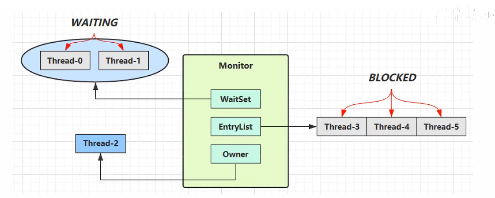
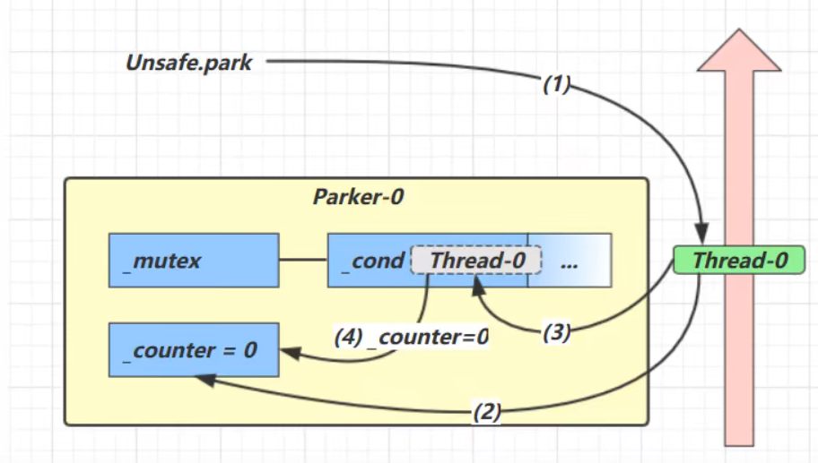
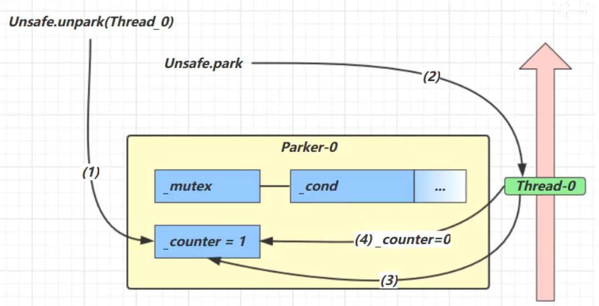
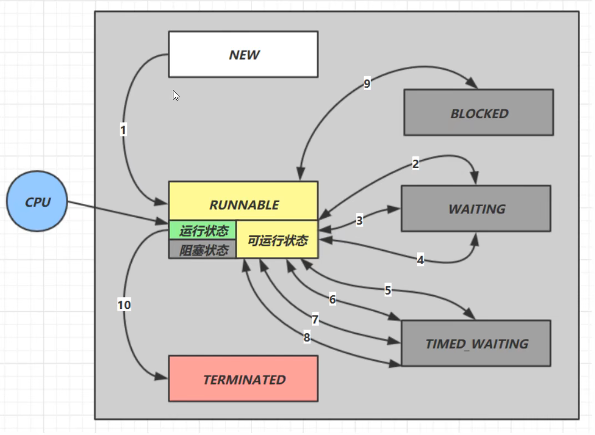
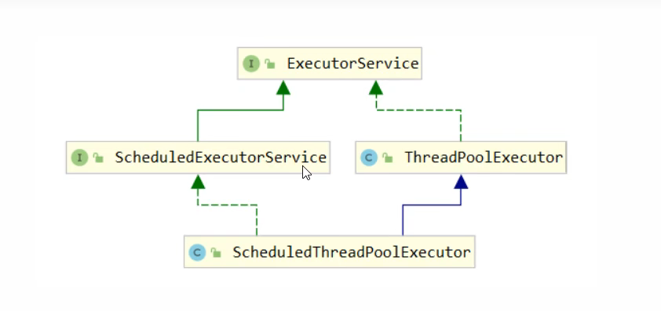
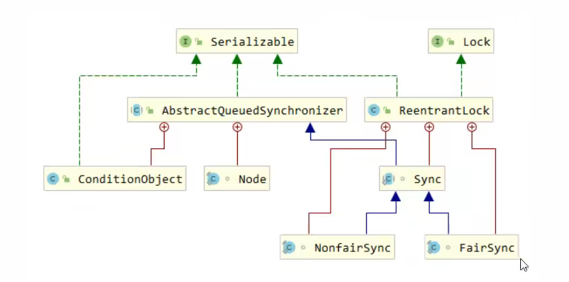
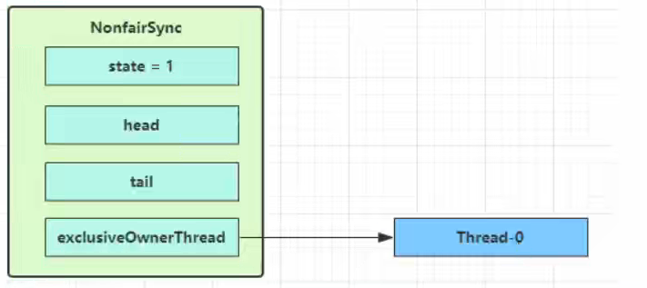
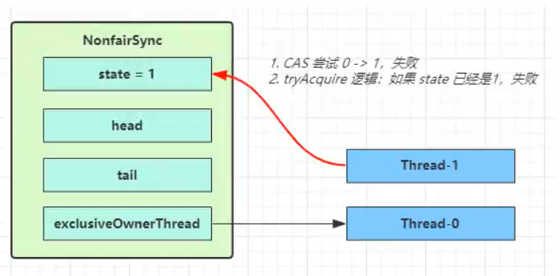
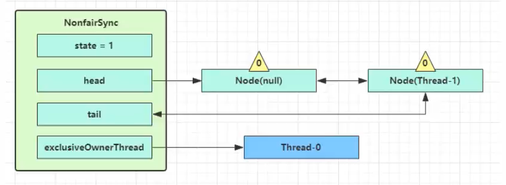

# Java多线程

## 0、引言

### 什么是进程、线程？

* **进程** ：<font color=red>`资源分配的最小单位`</font>,CPU从磁盘中读取一段程序到内存中，该执行程序的实例就叫做进程。一个程序如果被CPU多次读取到内存中，则变成多个独立的进程。
* **线程** ：线程是程序执行的最小单位，在一个进程中可以有多个不同的线程。

**为什么要使用多线程？** **采用多线程的形式执行代码，目的是为了提高程序开发的效率。**

### 什么是同步、异步？

* 需要等待结果返回再执行其他代码就是同步
* 不需要等待结果返回，就能继续执行其他代码的就是同步

## 1、线程基础

### 1.1 创建多线程

方法一：

```java
class runnable implement Runnable{
    @Override
    public void run(){
        // 此处写方法体就行
    }
}
```

方法二：使用`FutureTask`方法,可以用对象名+get()方法获取返回值。在获取到返回之前get方法会一直阻塞等待返回结果

```java
FutureTask<返回值类型,泛型> task = new FutureTask<>(new Callable<返回值类型，泛型>(){
    @Override
    public 返回值类型 call() throws Exception{
        // 此处写方法体
        return ...
    }
});
new Thread(task).start;
```

方法三：

```java
class runnable implement Callable{
    @Override
    public void run(){
        // 此处写方法体就行
    }
}
```

方法四：

```java
class thread extends Thread{
    @Override
    public void run(){
        // 此处写方法体就行
    }
}
```

### 1.2 线程运行

#### 1.2.1 栈与堆栈

`Java Virtual Machine Stacks` （Java虚拟机栈）

JVM中由堆、栈、方法区组成，每个线程启动时，虚拟机就会给线程分配一块栈内存

* 每个栈由多个栈帧（Frame）组成，对应着每次方法调用时所占的内存
* 每个线程只能有一个活动栈帧，对应着当前正在执行的那个方法
* 每个线程都有唯一的栈帧，且都互不干扰

#### 1.2.2 线程的上下文切换(Thread Context Switch)

因为以下原因导致`cpu`不再执行当前线程转而执行另一个线程代码：

1. 线程`cpu`时间片用完
2. 垃圾回收
3. 有更高优先级的线程需要运行
4. 线程自己调用了`sleep、yield、wait、join、park、synchronized、lock`等方法

当Content Switch 发生时，需要由操作系统保存当前的线程状态，并恢复另一个线程的状态，Java中对应的概念就是线程计数器(Program Counter Register)，它的作用就是记住下一条JVM指令的执行地址，是线程私有的

+ 状态包括程序计数器、虚拟机栈中的每个栈帧的信息，如局部变量、操作数栈、返回地址等
+ Context Switch频繁发生会影响性能

### 1.3 线程常见方法

| 方法名 static      | 功能说明                                             | 注意                                                         |
| :----------------- | ---------------------------------------------------- | ------------------------------------------------------------ |
| `start()`          | 启动一个新线程，在新的线程运行run方法中的代码        | start只是让线程进入就绪，里面的代码不一定立即执行(CPU时间片还没分配)。每个线程对象的start方法只能调用一次，如果多次调用会出现`IllegalThreadStateException` |
| `run()`            | 新的线程启动后会调用的方法                           | 如果在构造Thread对象时传递了Runnable参数，则线程启动后会调用Runnable中的run方法，否则默认不执行任何操作。但可以创建Thread的子类对象，来覆盖默认行为 |
| `join()`           | 等待线程运行结束                                     | 线程状态应该是`WAITING`                                      |
| `join(long n)`     | 等待线程运行结束，最多等待n毫秒                      |                                                              |
| `gerId()`          | 获取线程长整型的ID                                   | ID唯一                                                       |
| `getName()`        | 获取线程名                                           |                                                              |
| `setName(String)`  | 修改线程名                                           |                                                              |
| `getPriority()`    | 获取线程优先级                                       |                                                              |
| `setPriority(int)` | 修改线程优先级                                       | Java中规定线程的优先级是1~10的整数，较大的优先级能提高线程被CPU调用的几率 |
| `getState()`       | 获取线程状态                                         | Java中线程状态用6个`enum`表示，分别为：`NEW,RUNNABLE,BLOCKED,WAITING,TIMED_WAITING,TERMINTED` |
| `isInterrupted()`  | 判断线程是否被打断                                   | Boolean类型值，不会清除打断标记。sleep的情况下打断，线程不会继续执行，而是会抛出异常。但是抛出异常后会重新把`isInterrupted()`这个布尔值设置为`false`。所以要在catch异常后重新执行interrupt()方法。 |
| `isAlive()`        | 判断线程是否存活                                     |                                                              |
| `interrupt()`      | 打断线程                                             |                                                              |
| `interrupted()`    | 判断当前线程是否会被打断                             | 会清除`打断标记`，就是说在打断后因为返回的值是`Boolean`类型，所以会给值赋值为`True`，但是在执行后会立即把`interrupted`()的值设置为`False` |
| `currentThread()`  | 获取当前正在执行的线程                               |                                                              |
| `sleep(long n)`    | 让当前线程休眠n毫秒，休眠时让出CPU的时间片给其他线程 | 可以使用`TimeUnit`包，来替代`sleep`以获取更好的可读性。但内部还是调用了sleep方法，对应的线程状态应该是`TIME_WAITING` |
| `yield()`          | 提示线程调度器让出当前线程堆CPU的使用                | 主要是为了测试和调试                                         |
| `setDaemon()`      | 设置守护线程                                         | 参数为`true`时则为守护线程。默认为用户线程                   |

`isInterrupted()`优雅退出线程

```java
public static void main(String[] args) throws InterruptedException {
    Thread thread1 = new Thread(() -> {
        while (true) {
            Thread current = Thread.currentThread();
            if (current.isInterrupted()) {
                System.out.println("线程即将退出");
                break;
            }
            try {
                Thread.sleep(1000);
                System.out.println("记录信息");
            } catch (InterruptedException e) {
                // sleep过程中被打断后会重新设置isInterrupted()参数为false，因此需要再次打断线程
                current.interrupt();
                e.printStackTrace();
            }
        }
    });

    Thread thread2 = new Thread(() -> {
        try {
            Thread.sleep(10000);
            System.out.println("即将终止t1线程");
        } catch (InterruptedException e) {
            e.printStackTrace();
        }
        thread1.interrupt();
    });

    thread1.start();
    thread2.start();
}
```


### 1.4主线程与守护线程

默认情况下，Java进程需要等待所有线程都运行结束才会结束。有一种特殊的线程叫做守护线程，只要其他非守护线程运行结束了，即使守护线程的代码没有执行完，也会强制结束。

+ 垃圾回收机制(`gc`)就是一种守护线程
+ Tomcat中的`Acceptor`和`Poller`线程都是守护线程，所以Tomcat接收到shutdown命令后，不会等待它们处理完当前请求。

### 1.5 线程状态

#### 1.5.1 操作层面描述（五种状态）

+ 初始状态：仅是在语言层面上创建了线程对象，还未与操作系统线程关联
+ 可运行状态：（就绪状态）指该线程已被创建（与操作系统关联），可以由CPU调度执行
+ 运行状态：指获取了CPU时间片运行中的状态
  + 当CPU时间片用完，会从**运行状态**转到**可运行状态**，会导致线程上下文切换
+ 阻塞状态：
  + 如果调用了阻塞API，如BIO读写文件，这时该线程就不会用到CPU，会导致线程上下文切换，进入**阻塞**状态
  + 等BIO操作完毕，会由操作系统唤醒阻塞的线程，转换至**可运行状态**
  + 与**可运行状态**区别的是，堆**阻塞状态**的线程来说只要它们一直不唤醒，调度器就一直不会考虑调度他们
+ 终止状态：表示线程已经执行完毕，生命周期已经结束，不会再转换为其他状态

#### 1.5.2 Java API层面描述（六种状态）

+ `NEW`：线程刚被创建，但是还没有调用start()方法
+ `RUNNABLE`：当调用了start()方法后，注意，Java API层面的`RUNNABLE`状态涵盖了**操作系统**层面的**可运行状态**、**运行状态**和**阻塞状态**（由于BIO导致的线程阻塞，在Java中无法区分，仍然认为是可运行）
+ `BLOCKED`、`WAITING`、`TIME_WAITING`都是**Java API层面**对**阻塞状态**的细分
+ `TERMINATED`：线程代码运行结束的状态

## 2、共享模型之管控

### 2.1 引言

#### 2.1.1 临界区 Critical Section

+ 一个程序运行多个线程本身并没有什么问题
+ 问题出在多线程访问**共享资源**
  + 多个线程读**共享资源**其实也没有问题
  + 在多个线程对**共享资源**读写操作时发生指令交错，就会出现问题
+ <font color=green>**定义**</font>：<font color=red>一段代码内如果存在对**共享资源**的多线程读写操作，则称这段代码块为**临界区**</font>

``` java
static int counter = 0;

static void increment()
// 临界区，因为此时对静态变量counter出现读和写的操作
{
    counter++;
}

static void decrement()
// 临界区，因为此时对静态变量counter出现读和写的操作
{
    counter--;
}
```

#### 2.1.2 竞态条件 Race Condition

多个线程在临界区内执行，由于代码的**执行序列不同**而导致的结果无法预测，称为发生了**竞态条件**

### 2.2 synchronized

<font color=pink; size=5>语法</font>

```java
synchronized(对象){
    // 临界区
}
```

<font color=green; size=5>应用之互斥</font>

为了避免临界区的竞态条件发生，有多种手段可以到达目的

+ 阻塞式的解决方案：synchronized， Lock
+ 非阻塞式的解决方案： 原子变量

synchronized为俗称的**对象锁**，它采用互斥的方式让同一时刻至多只有一个线程能持有**对象锁**，其他线程在想获取这个**对象锁**时就会阻塞住。这样就能保证拥有锁的线程可以安全的执行临界区内的代码，不用担心线程上下文切换

<font color=blue; size=5>注意</font>

虽然Java中互斥和同步都可以采用synchronized关键字来完成，但是他们实际上还是存在区别：

+ 互斥是保证临界区的竞态条件发生，同一时刻只能有一个线程执行临界区代码
+ 同步是由于线程执行的先后、顺序不同，需要一个线程等待其他线程运行到某个点

synchronized实际是用**对象锁**保证了**临界区内代码的原子性**，临界区内的代码对外是不可分割的，不会被线程切换所打断

#### 2.2.1 方法上的synchronized

+ synchronized只能锁住对象，加在成员方法上锁住的是this对象

```java
class Test{
    public void test(){
        synchronized(this){
        	// 临界区
    	}
    }   
}
等价于
class Test{
    public void synchronized test(){
        // 临界区
    }
}

// 方法1方法2均为synchronzied修饰方法，且都在Test类下
public static void main(String[] args){
    Test t1 = new Test();
    Test t2 = new Test();
    // 此时，synchronized锁住的对象是t1、t2， 因为两个锁对象不同，所以不存在互斥
    new Thread(() -> {t1.方法1}).start();
    new Thread(() -> {t2.方法2}).start();
    // 此时，synchronized锁住的对象是t1，锁对象相同，因此存在互斥关系。必须等待持有锁的线程结束才会继续执行其他线程
    new Thread(() -> {t1.方法1}).start();
    new Thread(() -> {t1.方法2}).start();
}

```

+ 静态方法：synchronized锁住Test类对象

```java
class Test{
    public static void test(){
        synchronized(Test.class){
            // 临界区
        }
    }
}
等价于
class Test{
    public synchronized static void test(){
        // 临界区
    } 
}


public static void main(String[] args){
    Test t1 = new Test();
    Test t2 = new Test();
    // 此时，synchronized修饰的方法为静态方法，也就是不管新建几个对象，锁的对象都是Test.class，因此存在互斥关系
    new Thread(() -> {t1.方法1}).start();
    new Thread(() -> {t2.方法2}).start();
}
```

### 2.3 变量的线程安全分析

#### 2.3.1 成员变量和静态变量线程安全

+ 如果它们没有共享，线程则安全
+ 如果它们被共享了，根据他们的状态能否改变，又分为两种情况：
  + 如果只有读操作，则线程安全
  + 如果有读写操作，则这段是代码是临界区，需要考虑线程安全

#### 2.3.2 局部变量线程安全

+ 局部变量线程是安全的
+ 但局部变量引用的对象未必安全：
  + 如果该对象没有逃离方法的作用范围，他是线程安全的
  + 如果该方法逃离方法的作用范围，则需要考虑线程安全

#### 2.3.3 常见线程安全类

+ String
+ Integer
+ StringBuffer
+ Random
+ Vector
+ Hashtable
+ java.util.concurrent包下的类

这里说的**线程安全**是指多个线程调用他们的同一个实例的某个方法是，线程是安全的

```java
// Hashtable方法使用了synchronized修饰
Hashtable table = new Hashtable();

new Thread(()->{
    table.put("key", "value1")
}).start();

new Thread(()->{
    table.put("key", "value2")
}).start();
```

但是：

+ 他们的每个方法是原子的
+ 但是它们多个方法的组合不是原子的

```java
Hashtable table = new Hashtable();
// 线程1， 线程2
if(table.get("key") == null){
    table.put("key", value);
}
// 此时线程是不安全的
```

```mermaid
sequenceDiagram
participant t1 as 线程1
participant t2 as 线程2
participant table
t1 ->> table : get("key") == null
t2 ->> table : get("key") == null
t2 ->> table : put("key", v2)
t1 ->> table : put("key", v1)
```

String、Integer等都是不可变类，因从其内部的状态不可以改变，因此他们的线程方法都是线程安全的

### 2.4 买票实例

```java
package com.Thread;

import java.util.ArrayList;
import java.util.List;
import java.util.Random;
import java.util.Vector;

/**
 * @author 11276
 */
public class SellTicket {
    public static void main(String[] args) throws InterruptedException {
        TicketWindow window = new TicketWindow(1000000);

        List<Thread> threadList = new ArrayList<Thread>();
        List<Integer> amountList = new Vector<>();
        for (int i = 0; i < 20000; i++) {
            Thread thread = new Thread(() -> {
                int amount = window.sell(randomNumber(5));
                amountList.add(amount);
            });
            threadList.add(thread);
            thread.start();
        }

        for (Thread thread : threadList) {
            thread.join();
        }

        System.out.println("余票:"+ window.getCount());
        System.out.println("卖出的" + amountList.stream().mapToInt(i->i).sum());
    }


    public static int randomNumber(int amount) {
        Random random = new Random();
        return random.nextInt(amount) + 1;
    }
}

class TicketWindow {
    private int count;

    public TicketWindow(int count) {
        this.count = count;
    }

    public int getCount(){
        return count;
    }

    public synchronized int sell(int amount) {
        if (this.count >= amount) {
            this.count -= amount;
            return amount;
        } else {
            return 0;
        }
    }
}

// running result:
// 余票:939975
// 卖出的60025

```

### 2.5 Monitor概念

#### 2.5.1 Java对象头

以32位虚拟机为例：

普通对象

```ruby
|------------------------------------------------|
|			Object Header(64 bits)				 |
|------------------------------------------------|
|	Mark Word(32 bits) |	Klass Word(32 bits)	 |
|------------------------------------------------|
Klass Word 是加锁指针
```

数组对象

```ruby
|-------------------------------------------------------------------------|
|			             Object Header(96 bits)	     	   			      | 
|-------------------------------------------------------------------------|
|	Mark Word(32 bits) |	Klass Word(32 bits)	 |  array length(32 bits) |
|-------------------------------------------------------------------------|
```

Mark Word结构为

```ruby
|-----------------------------------------------------------------------------|
|			           Mark Word(32 bits)     	   		|         State	      |     
|-----------------------------------------------------------------------------|
|	 hashcode:25   |  age:4  |   biased_lock:0   |  01  |         Normal      |
|-----------------------------------------------------------------------------|
|	 thread:23 | epoch:2 | age:4 | biased_lock:1 |  01  |         Biased      |
|-----------------------------------------------------------------------------| 
|	              ptr_to_lock_record:30          |  00  |  Lightweight_LOcked |
|-----------------------------------------------------------------------------|
|	       ptr_to_heaveyweight_monitor:30        |  10  |  Lightweight_LOcked |
|-----------------------------------------------------------------------------|
|	      								         |  11  |    Marked for GC    |
|-----------------------------------------------------------------------------|
```


#### 2.5.2 Monitor（锁）



+ 刚开始Monitor中的Owner为null
+ 当Thread-2执行到`synchronized(obj)`时就会将所有者的Owner置为Thread-2，且Monitor中只能有一个Owner
+ 在Thread-2上锁的过程中，如果Thread-3，Thread-4，Thread-5也来执行`synchronized(obj)`，就会进入到`EntryLIst`且状态为BLOCKED
+ Thread-2执行完同步代码块中的内容时，会唤醒`EntryList`中的等待的线程来竞争锁，竞争的过程是非公平的(JDK底层实现的)
+ 图中`WaitSet`中的Thread-0， Thread-1是之前获得过锁，但条件不满足而进入WAITING状态的线程

**注意：**

+ synchronized必须是进入同一个对象的Monitor才有上述效果
+ 不加synchronized的对象不会关联Monitor，不遵从上述规则

### 2.6 原理之wait/notify

+ Owner线程发现条件不满足，调用wait方法，即可进入WaitSet变为WAITING状态
+ BLOCKED和WAITING的线程都处于阻塞状态，不占用CPU时间片
+ BLOCKED线程会在Owner线程释放锁时唤醒
+ WAITING线程会在Owner线程调用notify或notifyAll时唤醒，但唤醒后并不意味着立刻获得锁，仍需要进入EntryList重新竞争

#### 2.6.1 API介绍

+ obj.wait()：让进入object监视器的线程到waitSet等待

```java
public final void wait() throws InterruptedException {
        wait(0L);
    }
```

+ obj.notify()：在object上正在waitSet等待的线程中选择一个进行唤醒，但是会出现虚假唤醒的问题

```java
@IntrinsicCandidate
    public final native void notify();
```

+ obj.notifyAll()：让object上正在waitSet等待的线程全部唤醒

```java
@IntrinsicCandidate
    public final native void notifyAll();
```

```java
// while解决全部唤醒但是又条件不满足的问题
static fianl Object lock = new Object();
synchronized(lock){
    while(条件不成立){
        lock.wait();
    }
    // 条件程成立执行以下代码
    ...
}
// 另一个线程
synchronized(lock){
    lock.notifyAll();
}
```

**注意：**

+  他们都是线程间进行协作的手段，都属于Object方法
+ 必须获得Object对象的锁，才能调用这几个方法。没获取到锁的时候会报异常：`java.lang.IllegalMonitorStateException`

#### 2.6.2 sleep 和wait的区别

```java
public static native void sleep(long millis) throws InterruptedException;
```

+ sleep是Thread方法，而wait是Object方法
+ sleep不需要强制和synchronized一起使用，但wait需要和synchronized一起使用
+ sleep对象在睡眠时不会释放对象锁，但wait在等待时会释放对象锁
+ 他们的状态都是TIMED_WAITING

### 2.7 <font face='楷体'>Park/Unpark</font>

与Object的wait/notify相比：

+ wait，notify和notifAll必须配合Object Monitor一起使用，而park/unpark则不需要
+ park/unpark是以线程为单位来**阻塞**和**唤醒**线程，而notify只能随即唤醒一个等待线程，notifyAll是唤醒所有等待线程，就不那么**精确**
+ park/unpark可以先unpark，而wait/notify则不能先notify

#### 2.7.1 原理之park/unpark

每个线程都有自己的park对象，且由三部分组成：_counter, _cond和 _mutex组成



线程使用park时：

+ 检查_counter，上图为0，这时会获得 _mutex互斥锁
+ 线程进入 _cond条件变为阻塞
+ 设置 _counter为0 (不管之前 _counter是否为0，仍会再设置为0)


线程使用unpark时：

+ 先设置 _counter为1
+ 唤醒 _cond条件变量中的Thread_0
+ Thread_0恢复运行
+ 设置_counter为0



线程先调用unpark再使用park时：

+ 线程调用unpark方法，设置_counter 为1
+  线程调用park方法
+ 检查_counter，之前设置为1，这时线程**无需阻塞**，继续运行
+ 设置_counter为1

### 2.8 多线程状态转换



现在有线程Thread T

+ NEW --> RUNNABLE

  + 当调用start()方法时，有NEW --> RUNNABLE

+ RUNNBALE <--> WAITING

  T 线程使用了synchronized获得了锁对象之后

  1. wait/notify

     + 调用obj.wait()方法时，T线程从RUNNABLE --> WAITING

     + 调用obj.notify()，obj.notifyAll()，interrupt()时
       + 竞争锁成功，T线程从WAITING --> RUNNABLE
       + 竞争锁失败，T线程从WAITING -> BLOCKED

  2. join

     + 当线程调用join()方法时，**当前线程** (调用join()方法的线程) 从RUNNABLE --> WAITING
       + 注意：是**当前线程**在**T线程对象**的监视器上等待

     + T线程运行结束，或调用了**当前线程**的interrupt()时，**当前线程**会从WAITING --> RUNNABLE

  3. LockSupport.park()

     + 当前线程调用LockSupport.park()方法会让当前线程从RUNNABLE --> WAITING

     + 调用LockSupport.unpark(目标线程)或调用了线程的interrupt()，会让目标线程从WAITING --> RUNNABLE

+ RUNNABLE <--> TIMED_WAITING

  T 线程使用了synchronized获得了锁对象之后

  1. `wait(long n)`
     + 调用obj.wait(long n)方法时，T线程从RUNNABLE --> TIMED_WAITING
     + T线程**等待时间**超过了n毫秒，或调用obj.notify()，obj.notifyAll()，T.interrupt()时
       + 竞争锁成功，T线程从TIMED_WAITING --> RUNNABLE
       + 竞争锁失败，T线程从TIMED_WAITING --> BLOCKED
  2. `join(long n)`
     + **当前线程**调用T.join(long n)方法时，当前线程从RUNNABLE --> TIMED_WAITING
       + 注意：是**当前线程**在**T线程对象**的监视器上等待
     + **当前线程**等待时间超过n毫秒、或**T线程**运行结束、或调用了**当前线程**的interrupt()时，当前线程从TIMED_WAITING --> RUNNABLE
  3. sleep(long n)
     + **当前线程**调用Thread.sleep(long n)，**当前线程**从RUNNABLE --> TIMED_WAITING
     + **当前线程**等待时间超过了n毫秒，**当前线程**从TIMED_WAITING --> RUNNABLE
  4. LockSupport(long nanos)
     + 当前线程调用LockSupport.parkNanos(long nanos)或Lock Support.parkUntil(long millis)时，当前线程从RUNNABLE --> TIMED_WAITING
     + 调用LockSupport.unpark(目标线程)或调用了线程的interrupt()、或是等待超时，会让目标线程从TIMED_WAITING --> RUNNABLE

+ RUNNABLE <--> BLOCKED

  + **T线程用**synchronized(obj)获取了对象锁时如果竞争失败，从RUNNABLE --> BLOCKED
  + 持有obj锁线程的同步代码块执行完毕，会唤醒该对象上的所有BLOCKED的线程重新竞争，如果其中的T线程竞争成功，从BLOCKED --> RUNNABLE, 其他线程仍会BLOCKED

+ RUNNABLE --> TERMINATED

  + 当前线程所有代码运行完毕，进入TERMINATED

### 2.9 死锁

多个线程各自占用一些公共资源，并且互相等待其他线程占有的资源释放才能运行，而导致两个或者多个线程都在等待对方释放资源，都停止执行的情形。某一个同步块同时拥有<font color=red>*“两个以上对象的锁”*</font>时，就可能会发生死锁的问题。

### 2.10 ReentrantLock

相对于synchronized，ReentrantLock具备以下特点

+ 可中断
+ 可以设置超时时间
+ 可以设置为公平锁
+ 支持多个条件变量（可以理解为存在多个waitSet，notify可以精准唤醒）

与synchronized一样，都支持可重入（同一个线程自己反复加锁）

基本语法：

```java
// 获取锁
reentrantLock.lock();
try{
    // 临界区
} finally {
    // 释放锁
    reentrantLock.unlock();
}
```

#### 2.10.1 可重入

可重入是指同一个线程如果首次获得了这把锁，那么因为它是这把锁的拥有者，因此有权利再次获取这把锁。

如果是不可重入锁，那么第二次获得锁时，自己也会被锁挡住。

#### 2.10.2 打断锁

可以使用lockInterruptibly()方法来给线程增加可打断锁。也可以作为解决死锁的一种办法。

```java
private static ReentrantLock lock = new ReentrantLock();
lock.lock();
new Thread(()->{
    try {
        lock.lockInterruptibly();
    } catch (InterruptedException e) {
        System.out.println("打断");
        e.printStackTrace();
    }
});
lock.lock();
t1.start();
Thread.sleep(1000);
t1.interrupt();

// 结果
打断
java.lang.InterruptedException
	at java.base/java.util.concurrent.locks.AbstractQueuedSynchronizer.acquireInterruptibly(AbstractQueuedSynchronizer.java:959)
	at java.base/java.util.concurrent.locks.ReentrantLock$Sync.lockInterruptibly(ReentrantLock.java:161)
	at java.base/java.util.concurrent.locks.ReentrantLock.lockInterruptibly(ReentrantLock.java:372)
	at com.Thread.Test1.lambda$main$0(Test1.java:13)
	at java.base/java.lang.Thread.run(Thread.java:833)
```


#### 2.10.3 锁超时

```java
// tryLock()也支持使用interrupt()打断线程
private static ReentrantLock lock = new ReentrantLock();
lock.lock();	// 主线程先获得锁
new Thread(()->{
    if (!lock.tryLock()){	// tryLock()返回值为Boolean类型
        return;	// 这里没有获取到锁，所以一定会返回
    }
}).start();
```

```java
private static ReentrantLock lock = new ReentrantLock();
public static void main(String[] args) throws InterruptedException {
    Thread t1 = new Thread(()->{
        try {
            if(!lock.tryLock(1, TimeUnit.SECONDS)) {	// 线程等待1s，获取不到锁直接返回，主线程不释放锁的话不等待主线程释放锁
                System.out.println("获取不到锁");
                return;
            }
        } catch (InterruptedException e) {
            e.printStackTrace();
        }
        try{
            System.out.println("获得到锁");
        } finally {
            lock.unlock();
        }
    }, "t1");

    lock.lock();

    try{
        System.out.println("main获得到锁");
    }finally{
        lock.unlock();
    }
    t1.start();
}
// 输出结果为。因为主线程释放了锁
main获得到锁
获得到锁
```

#### 2.10.4 公平锁

公平锁一般没有使用的必要，会降低并发度

#### 2.10.5 条件变量

synchronized只支持一个waitSet，而ReentrantLock支持多个waitSet

使用流程：

+ await前需要获得锁
+ await执行后，会释放锁，进入conditionObject等待
+ await的线程被唤醒（或打断、或超时）去重新竞争锁
+ 竞争lock锁成功后，从await继续执行

```java
// 创建新的条件变量（waitSet）
Condition condition = lock.newCondition();
lock.lock();
// 线程进入waitSet
condition.await();
// 唤醒waitSet中的线程
condition.signal();
```

## 3、共享模型之内存

### 3.1 Java内存模型

JMM即Java Memory Model，它定义了主存、工作内存抽象概念，底层对应着寄存器、缓存、硬件内存、CPU指令优化等

JMM 体现在以下几个方面：

+ 原子性：保证指令不会受到线程上下文切换的影响
+ 可见性：保证指令不会受到CPU缓存的影响
+ 有序性：保证指令不会受到CPU指令并优化的影响

### 3.2 可见性、有序性

```java 
// 可见性问题的例子
static boolean run = true;
// volatile static boolean run = true;
public static void main(String[] args) throws InterruptedException {
    new Thread(() -> {
        while (run) {
            //
        }
    }).start();

    Thread.sleep(1000);
    System.out.println("stop");
    run = false;
}
// 此时线程会一直运行下去。
// 因为在线程读取的值是在线程高速缓存区中的值而不是在主内存中
// while循环中加入输出语句则会停止线程，因为输出语句是线程安全的
```

解决上述可见性问题：

+ `volatile`可以用来修饰成员变量和静态变量，它可以避免线程从自己的工作缓存中查找变量的值，必须到主存中获取它的值，线程操作volatile变量都是直接操作主存。

+ 使用线程锁也可以解决可见性问题

#### 3.2.1 可见性 VS 原子性

+ 可见性保证的是在多个线程之间，一个线程对`volatile`变量的修改对另一个线程可见，不能保证原子性，仅适用在一个线程写，一个线程读的情况。

+ synchronized语句块既可以保证代码块的原子性，也同时保证代码块内变量的可见性。但缺点是synchronized属于重量级操作，性能相对更低。

### 3.3 volatile如何保证可见性

+ 写屏障(sfence)保证在该屏障之前，对共享变量的改动都同步到主存中

  ```java
  public void actor2(I_Result r) {
      num = 2;
      ready = true; // ready是volatile赋值带写屏障
      // 写屏障
  }
  ```

+ 而读屏障(lfence)保证在该屏障之后，对共享变量的读取，加载的都是主存中的最新数据

  ```java
  public void actor1(I_Result r) {
      // 读屏障
      // ready是volatile赋值带读屏障
      if(ready) {
          r.r1 = num + num;
      }else{
          r.r1 = 1;
      }
  }
  ```

### 3.4 volatile如何保证有序性

+ 写屏障(sfence)保证指令重排序前，不会将写屏障之前的代码排在写屏障之后

  ```java
  public void actor2(I_Result r) {
      num = 2;
      ready = true; // ready是volatile赋值带写屏障
      // 写屏障
  }
  ```

+ 而读屏障(lfence)保证指令重排序时，不会讲读屏障之后的代码排在读屏障之前

  ```java
  public void actor1(I_Result r) {
      // 读屏障
      // ready是volatile赋值带读屏障
      if(ready) {
          r.r1 = num + num;
      }else{
          r.r1 = 1;
      }
  }
  ```

总结： volatile并不能解决指令交错

+ 写屏障仅仅是保证了之后的读能够获取到最新的结果，但并不能保证读跑到它前面去
+ 而有序性也只保证了本线程内相关代码不被重排序

### 3.5 happens-before

happens-before规定了对共享变量的写操作对于其他现成的读操作可见，他是可见性与有序性的一套规则的总结。抛开以下happens-before规则，JVM并不能保证一个线程对共享变量的写，对于其他线程对该共享变量的读可见

+ 线程解锁lock之前对于共享变量的写，对于接下来对lock加锁的其他线程对该共享变量的读可见

  ```java
  static int x;
  static final Object lock = new Object();
  public static void main(String[] args) throws InterruptedException {
      new Thread(()->{
          synchronized (lock) {
              x = 10;
          }
      }).start();
  
      new Thread(()->{
          synchronized (lock) {
              System.out.println(x);
          }
      }).start();
  }
  // 输出10
  ```

+ 线程volatile变量的写，对接下来其他线程对该变量的读可见

  ```java
  volatile static int y;
  public static void main(String[] args) throws InterruptedException {
      new Thread(() -> {
          y = 10;
      }).start();
  
      new Thread(() -> {
          System.out.println(y);
      }).start();
  }
  // 输出10
  ```

+ 线程start之前对该变量的写，对该线程开始后的该变量的读可见

  ```java
  static int x;
  public static void main(String[] args) throws InterruptedException {
      x = 10;
      new Thread(() -> {
          System.out.println(x);
      }).start();
  }
  ```

+ 线程结束前对变量的写，对其他线程得知它结束后的可见性（比如其他线程调用isAlive()或join()等待它结束）

  ```java
  static int x;
  public static void main(String[] args) throws InterruptedException {
      Thread thread1 = new Thread(() -> {
          x = 10;
      });
      thread1.start();
      thread1.join();
      System.out.println(x);
  }
  ```

+ 线程t1打断t2前对变量的写，对于其他线程得知t2被打断后对变量的读可见

  ```java
  static int x;
  public static void main(String[] args) throws InterruptedException {
      Thread thread1 = new Thread(() -> {
          while (true) {
              if (Thread.currentThread().isInterrupted()) {
                  System.out.println(x);
                  break;
              }
          }
      });
      thread1.start();
      new Thread(()->{
          try {
              Thread.sleep(1000);
              x = 10;
              thread1.interrupt();
          } catch (InterruptedException e) {
              e.printStackTrace();
          }
      }).start();
  
      while (!thread1.isInterrupted()) {
          Thread.yield();
      }
      System.out.println(x);
  }
  ```

+ 对变量默认值（0， false， null）的写，对其他线程对该变量的读可见

+ 具有传递性，如果 x hb -> y 并且 y hb -> z，配合volatile的防指令重排，有以下例子

  ```java
  volatile static int x;
  static int y;
  public static void main(String[] args) throws InterruptedException {
      new Thread(()->{
          y = 10;
          x = 20;
      }).start();
  
      new Thread(()->{
          // x = 20 对当前线程可见，同时y = 20也对当前线程可见
          System.out.println(x);
          System.out.println(y);
      }).start();
  }
  ```


## 4、共享模型之无锁

### 4.1 CAS与volatile

使用compareAndSet方法实现无锁操作，它的简称是CAS（也有compare And Swap的说法），它必须是原子操作

```java
AtomicInteger balabce = new AtomicInteger(10000);
int x = 100;
int y = 200;
balabce.compareAndSet(x, y);
```

CAS必须借助volatile才能读取到共享变量的最新值来实现**比较并交换**的效果

### 4.2 为什么无锁效率高

+ 无锁情况下，即使重试失败，线程始终在高速运行，没有停歇。而synchronized会让线程在没有获得锁的时候，发生上下文切换，进入阻塞状态
+ 但是无锁的情况下，因为线程要保持运行，需要额外的CPU的支持。虽然不会进入阻塞，但由于没有时间片，仍然会进入可运行的状态，还是会导致上下文切换

### 4.3 CAS特点

+ CAS是基于乐观锁的思想：最乐观的估计，不怕别的线程来修改共享变量
+ synchronized是基于悲观锁的思想：最悲观的估计，得防止其他线程来修改共享变量
+ CAS体现的是无锁并发、无阻塞并发
  + 因为没有使用synchronized，所以线程不会陷入阻塞，这是提升效率的因素之一
  + 但如果竞争激烈，可以想到重试必然频繁发生，反而效率会受到影响

### 4.4 原子整数

JUC并发包提供了以下原子类型：

+ AtomicBoolean
+ AtomicInteger
+ AtomicLong

```java
AtomicInteger x = new AtomicInteger(0);

// 先获取再自增， i=0,结果i=1，返回i=0， 类似x++
System.out.println(x.getAndIncrement());
// 先自增再获取，i=1 result i=2 return i=2 simple ++x
System.out.println(x.incrementAndGet());

// 先获取再自减 i=2 result i=1 return i=2 simple x--
System.out.println(x.getAndDecrement());
// 先自减再获取 i=1 result i=0 return i=0 simple --x
System.out.println(x.decrementAndGet());

// 先获取再加值 i=0 result i=5 return i=0
System.out.println(x.getAndAdd(5));
// 先加值再获取 i=5 result i=10 return i=10
System.out.println(x.addAndGet(5));

//             读取到    设置值
x.getAndUpdate(value -> value * 10);

System.out.println(x.get());
```

### 4.5 原子引用

+ AtomicReference
+ AtomicMarkableReference
+ AtomicStampedReference

### 4.6 原子数组

+ AtomicIntegerArray
+ AtomicLongArray
+ AtomicReferenceArray

## 5、线程池

```java
public class Test1 {
    public static void main(String[] args) {
        Pool pool = new Pool(2);
        for (int i = 0; i < 5; i++) {
            new Thread(()->{
                try {
                    Connection conn = pool.borrow();
                    Thread.sleep(100);
                    pool.free(conn);
                } catch (InterruptedException e) {
                    e.printStackTrace();
                }

            }).start();
        }

    }
}

class Pool {
    // 线程池大小
    private final int poolSize;
    // 链接对象数组
    private Connection[] connections;
    // 链接状态数组，0表示空闲，1表示繁忙
    private AtomicIntegerArray status;

    // 构造连接池方法
    public Pool(int poolSize) {
        this.poolSize = poolSize;
        this.connections = new Connection[poolSize];
        this.status = new AtomicIntegerArray(new int[poolSize]);
        for (int i = 0; i < poolSize; i++) {
            connections[i] = new MockConnection();
        }
    }

    // 借链接
    public Connection borrow() throws InterruptedException {
        while (true) {
            for (int i = 0; i < poolSize; i++) {
                // 获取空闲链接
                if (status.get(i) == 0) {
                    if (status.compareAndSet(i, 0, 1)) {
                        return connections[i];
                    }
                }
            }
            // 如果没有空闲连接，当前线程进入等待
            synchronized (this) {
                this.wait();
            }
        }
    }

    // 归还连接
    public void free(Connection conn) {
        for (int i = 0; i < poolSize; i++) {
            if (connections[i] == conn) {
                status.set(i, 0);
                synchronized (this) {
                    this.notifyAll();
                }
                break;
            }
        }

    }

}

class MockConnection implements Connection {
    @Override
    ......
}
```

### 5.1 自定义线程池

```java
package com.Thread;

import java.util.ArrayDeque;
import java.util.Deque;
import java.util.HashSet;
import java.util.concurrent.TimeUnit;
import java.util.concurrent.locks.Condition;
import java.util.concurrent.locks.ReentrantLock;

/**
 * @author 11276
 */
public class Test1 {
    public static void main(String[] args) {
        ThreadPool threadPool = new ThreadPool(2, 1000, TimeUnit.MILLISECONDS, 10, (queue, task) -> {
            // 1.一直等待下去
//            queue.put(task);
            // 2.带超时等待
//            queue.offer(task, 500, TimeUnit.MILLISECONDS);
            // 3.调用者线程放弃任务执行
//            System.out.println("放弃"+ task);
            // 4.调用者抛出异常
//            throw new RuntimeException("任务执行失败，" + task);
            // 5.调用者自己执行任务
            task.run();
        });
        for (int i = 0; i < 15; i++) {
            int j = i;
            threadPool.execute(() -> {
                try {
                    Thread.sleep(1000);
                } catch (InterruptedException e) {
                    e.printStackTrace();
                }
                System.out.println(j);
            });
        }
    }
}

// 拒绝策略
interface RejectPolicy<T> {
    void reject(BlockingQueue<T> queue, Runnable task);
}

class ThreadPool {
    // 任务队列
    private BlockingQueue<Runnable> taskQueue;
    // 线程集合
    private HashSet<Worker> workers = new HashSet();
    // 核心线程数
    private int coreSize;
    // 获取任务的超时时间
    private long timeout;
    private TimeUnit timeUnit;

    private RejectPolicy<Runnable> rejectPolicy;

    // 执行任务
    public void execute(Runnable task) {
        // 当任务数没有超过coreSize时，直接交给worker对象执行
        // 如果任务数超过coreSize数，则加入任务队列暂存
        synchronized (workers) {
            if (workers.size() < coreSize) {
                Worker worker = new Worker(task);
                System.out.println("新增worker:" + worker + ',' + task);
                workers.add(worker);
                worker.start();
            } else {
//                taskQueue.put(task);
                // 1.一直等下去
                // 2.带超时等待
                // 3.调用者线程放弃任务执行
                // 4.调用者抛出异常
                // 5.调用者自己执行任务
                taskQueue.tryPut(rejectPolicy, task);
            }
        }
    }

    public ThreadPool(int coreSize, long timeout, TimeUnit timeUnit, int queueCapacity, RejectPolicy<Runnable> rejectPolicy) {
        this.coreSize = coreSize;
        this.timeout = timeout;
        this.timeUnit = timeUnit;
        this.taskQueue = new BlockingQueue<>(queueCapacity);
        this.rejectPolicy = rejectPolicy;
    }

    class Worker extends Thread {
        private Runnable task;

        public Worker(Runnable task) {
            this.task = task;
        }

        @Override
        public void run() {
            // 执行任务
            // 1.当task不为空，执行任务
            // 2.当task执行完毕，再接着从任务队列获取任务并执行
            while (task != null || (task = taskQueue.pull(timeout, timeUnit)) != null) {
                try {
                    System.out.println("正在执行：" + task);
                    task.run();
                } catch (Exception e) {
                    e.printStackTrace();
                } finally {
                    task = null;
                }
            }
            synchronized (workers) {
                System.out.println("worker被移除" + this);
                workers.remove(this);
            }
        }
    }
}

class BlockingQueue<T> {
    // 1.任务队列
    private Deque<T> queue = new ArrayDeque<T>();
    // 2.锁
    private ReentrantLock lock = new ReentrantLock();
    // 3.生产者条件变量
    private Condition fullWaitSet = lock.newCondition();
    // 4.消费者条件变量
    private Condition emptyWaitSet = lock.newCondition();
    // 5.容量
    private int capacity;

    public BlockingQueue(int capacity) {
        this.capacity = capacity;
    }

    // 带有超时的阻塞获取
    public T pull(long timeout, TimeUnit unit) {
        lock.lock();
        try {
            // 时间转换为纳秒
            long nanos = unit.toNanos(timeout);
            while (queue.isEmpty()) {
                if (nanos <= 0) {
                    return null;
                }
                // 返回的是剩余的时间
                nanos = emptyWaitSet.awaitNanos(nanos);
            }
            T t = queue.removeFirst();
            fullWaitSet.signal();
            return t;
        } catch (InterruptedException e) {
            e.printStackTrace();
        } finally {
            lock.unlock();
        }
        return null;
    }

    // 阻塞获取
    public T take() {
        lock.lock();
        try {
            while (queue.isEmpty()) {
                emptyWaitSet.await();
            }
            T t = queue.removeFirst();
            fullWaitSet.signal();
            return t;
        } catch (InterruptedException e) {
            e.printStackTrace();
        } finally {
            lock.unlock();
        }
        return null;
    }

    // 阻塞添加
    public void put(T task) {
        lock.lock();
        try {
            while (queue.size() == capacity) {
                System.out.println("等待加入任务队列:" + task);
                fullWaitSet.await();
            }
            System.out.println("加入任务队列:" + task);
            queue.addLast(task);
            emptyWaitSet.signal();
        } catch (InterruptedException e) {
            e.printStackTrace();
        } finally {
            lock.unlock();
        }
    }

    // 带超时时间的阻塞添加
    public boolean offer(T task, long timeout, TimeUnit timeUnit) {
        lock.lock();
        try {
            long nanos = timeUnit.toNanos(timeout);
            while (queue.size() == capacity) {
                if (nanos <= 0) {
                    return false;
                }
                System.out.println("等待加入任务队列:" + task);
                nanos = fullWaitSet.awaitNanos(nanos);
            }
            System.out.println("加入任务队列:" + task);
            queue.addLast(task);
            emptyWaitSet.signal();
            return true;
        } catch (InterruptedException e) {
            e.printStackTrace();
        } finally {
            lock.unlock();
        }
        return false;
    }

    // 队列大小
    public int size() {
        lock.lock();
        try {
            return queue.size();
        } finally {
            lock.unlock();
        }
    }

    public void tryPut(RejectPolicy<T> rejectPolicy, T task) {
        lock.lock();
        try {
            // 判断队列是否已满
            if (queue.size() == capacity) {
                rejectPolicy.reject(this, (Runnable) task);
            } else {    // 队列空闲
                System.out.println("加入任务队列:" + task);
                queue.addLast(task);
                emptyWaitSet.signal();
            }
        } finally {
            lock.unlock();
        }
    }
}
```

### 5.2 ThreadPoolExecutor



#### 5.2.1 线程池状态

ThreadPoolExecutor使用int的高3位表示线程池的状态，低29位表示线程池中的线程数量

| 状态名          | 高3位 | 接收新任务 | 处理阻塞队列 | 说明                                         |
| --------------- | ----- | ---------- | ------------ | -------------------------------------------- |
| RUNNING         | 111   | Y          | Y            |                                              |
| SHUTDOWN        | 000   | N          | Y            | 不会接收新的任务，但是会处理阻塞队列剩余任务 |
| STOP            | 001   | N          | N            | 会中断正在运行的任务，并抛弃阻塞队列的任务   |
| TIDYING（过渡） | 010   | -          | -            | 任务全部执行完毕，活动线程位0，即将进入终结  |
| TERMINATED      | 011   | -          | -            | 终结状态                                     |

从数字上比较，TERMINATED>TIDYING>STOP>SHUTDOWN>RUNNING

这些信息存储在一个原子变量ctl中，目的是将线程池的状态与线程池的个数合二为一，这样就可以用一侧CAS原子操作进行赋值

```java
// c为旧值，cltOf返回结果为新值
ctl.compareAndSet(c, ctlOf(targetState, workerCountOf(c)))
    
// rs为高3位代表线程池的状态，wc为低29位表示线程个数，ctl是合并他们
private static int ctlOf(int rs, int wc){
    return rs | wc;
}
```

#### 5.2.2 构造方法

```java
public ThreadPoolExecutor(int corePoolSize,							// 核心线程数目（最多保留的线程数）
                          int maximumPoolSize,						// 最大线程数目
                          long keepAliveTime,						// 生存时间-针对救急线程
                          TimeUnit unit,							// 时间单位-针对救济线程
                          BlockingQueue<Runnable> workQueue,		// 阻塞队列
                          ThreadFactory threadFactory,				// 线程工厂-可以为线程创建时起名字
                          RejectExecutionHandler handler			// 拒绝策略
                         )
```

工作方式：

图中虚线表示线程未被创建，实线则为以创建线程。

初始时，核心线程有2个线程，最大线程数为3，则会创建一个救急线程。阻塞队列初始长度为2。

```mermaid
graph LR

subgraph 阻塞队列
size=2
end

subgraph 线程池c=2,m=3
ct1(核心线程1)
ct2(核心线程2)
mt1(救急线程)
end

t1(任务1)
t2(任务2)

style ct1 fill:#ccf,stroke:#f66,stroke-width:2px,stroke-dasharray:5, 5
style ct2 fill:#ccf,stroke:#f66,stroke-width:2px,stroke-dasharray:5, 5
style mt1 fill:#ccf,stroke:#f66,stroke-width:2px,stroke-dasharray:5, 5
```

核心线程会去执行任务，当任务数超过核心线程数时，会进入阻塞队列等待核心线程执行完毕。当阻塞队列满时，再有新的任务，则会交给救急线程进行执行。当任务5执行完毕后，救急线程则会进行销毁处理（未创建状态）。核心线程完成任务后，仍然会保留在线程池中，不会进行销毁。上面构造方法中的3、4参数可以设置救急线程存活时间。如果核心线程和救急线程全部繁忙，此时再新建任务才会有拒绝策略进行拒绝。

```mermaid
graph LR

subgraph 阻塞队列
size=2
t3(任务3)
t4(任务4)
end

subgraph 线程池c=2,m=3
ct1(核心线程1)
ct2(核心线程2)
mt1(救急线程)

ct1 -->t1(任务1)
ct2 -->t2(任务2)
mt1 -->t5(任务5)-->mt1
end

style ct1 fill:#ccf,stroke:#f66,stroke-width:2px
style ct2 fill:#ccf,stroke:#f66,stroke-width:2px
style mt1 fill:#ccf,stroke:#f66,stroke-width:2px
```

<h3>总结：</h3>

+ 线程池开始时没有线程，当一个任务提交给线程池后，线程池会创建一个新的线程来执行任务
+ 当线程数量达到了corePoolSize且没有线程空闲，这时再加入任务，新加的任务会被加入workQueue队列排队，直到有空闲线程
+ 如果队列选择了有界队列，那么任务数超过队列大小时，会创建maximumPoolSize - corePoolSize数目的线程来救急
+ 如果线程到达maximumPoolSize时仍有新任务，这是会执行拒绝策略。拒绝策略JDK提供了四种方式实现
  + AbortPolicy让调用者抛出RejectExecutionException异常，这是<font color=red>默认策略</font>
  + CallerRunsPolicy让调用者运行任务
  + DiscardPolicy放弃本次任务
  + DiscardOldestPolicy放弃队列中最早的任务，使用本任务取而代之
  + Dubbo的实现，在抛出RejectExecutionException异常之前会记录日志，并dump线程栈信息，方便定位问题
  + Netty的实现，是创建一个新的线程来执行任务
  + ActiveMQ的实现，带超时等待（60s）尝试放入队列，类似之前的自定义拒绝策略
  + PinPoint的实现，它使用了一个拒绝策略链，会逐一尝试策略链中的每种拒绝策略
+ 当高峰过后，超过corePoolSize的救急线程如果在一段时间内没有任务做，需要节省资源，这个时间由keepAliveTime和unit来控制救急线程存活时间


根据这个构造方法，JDK Executors类中提供了众多的工厂方法来创建各种用途的线程池

#### 5.2.3 创建线程池

+ newFiexThreadPool

  ```java
  public ExectorService newFixedThreadPool(int nThreads) {
          return new ThreadPoolExecutor(nThreads, nThreads, 
                  0L, TimeUnit.MILLISECONDS, 
                  new LinkedBlockingQueue<Runnable>());
  }
  ```

  特点：

  + 核心线程数等于最大线程数（没有救急线程被创建），因此也无需超时时间
  + 阻塞队列是无界的，可以放任意数量的任务

<h4>评价：适用于任务量已知，相对耗时的任务</h4>

+ newCachedThreadPool

  ```java
  public ExectorService newFixedThreadPool(int nThreads) {
          return new ThreadPoolExecutor(0, Integer.MAX_VALUE,
                  60L, TimeUnit.SECONDS,
                  new SynchronousQueue<Runnable>());
  }
  ```

  特点：

  + 核心线程数是0，最大线程数是Integer.MAX_VALUE，救急线程的空闲生存时间为60s，意味着
    + 全部都是救济线程（60s后可回收）
    + 救济线程可以无限创建
  + 队列采用了SynchronousQueue实现，特点是没有容量，没有线程来取是放不进去的

<h4>评价：整个线程池表现为线程数会根据任务量不断增长，没有上限。当任务执行完毕，空闲1分钟后直接释放线程。适用于任务数比较密集，但每个任务执行时间较短的情况</h4>

+ newSingleThreadExecutor

  ```java
  public static ExecutorService newSingleThreadExecutor() {
          return new FinalizableDelegatedExecutorService
              (new ThreadPoolExecutor(1, 1,
                                      0L, TimeUnit.MILLISECONDS,
                                      new LinkedBlockingQueue<Runnable>()));
  }
  ```

  使用场景：

  + 希望多个任务排队执行。线程数固定为1，任务数如果多于1时，会进入无界队列排队。任务执行完毕，这唯一的线程也不会被释放

  区别：

  + 自己创建一个单线程串行执行任务，如果任务失败而终止那么没有任何不久措施，而线程池还会新创建一个线程，保证池的正常运行
  + Executors.newSingleThreadExecutor()线程个数始终为1，不能修改
    + FinalizableDelegatedExecutorService 应用的是装饰器模式，只是对外暴露了ExecutorService接口，因此不能调用ThreadpoolExecutor中特有的方法
  + Exectors.newFixedThreadPool(1)初始为1，以后还可以修改
    + 对外暴露的是ThreadPoolExecutor对象，可以强转后调用setCoreSize等方法进行修改

#### 5.2.4 提交任务

```java
// 执行任务
void execute(Runnable command);
// 提交任务task，返回值Future获得任务执行结果
<T> Future<T> submit(Callable<T> task);
// 提交tasks中所有任务
<T> List<Future<T>> invokeAll(Collection<? extends Callable<T>> tasks)
        throws InterruptedException;
// 提交tasks中所有任务，带有超时
<T> List<Future<T>> invokeAll(Collection<? extends Callable<T>> tasks,
                                  long timeout, TimeUnit unit)
        throws InterruptedException;
// 提交tasks中所有任务，哪个任务先成功执行完毕，返回此任务的执行结果，其他任务取消
<T> T invokeAny(Collection<? extends Callable<T>> tasks)
        throws InterruptedException, ExecutionException;
// 提交tasks中所有任务，哪个任务先成功执行完毕，返回此任务的执行结果，其他任务取消，带有超时时间
<T> T invokeAny(Collection<? extends Callable<T>> tasks,
                    long timeout, TimeUnit unit)
        throws InterruptedException, ExecutionException, TimeoutException;
```

submit API：

```java
public static void main(String[] args) throws ExecutionException, InterruptedException {
    ExecutorService pool = Executors.newSingleThreadExecutor();
	// Future使用的是保护性暂停模式，等待另一个线程获取结果
    Future<String> future = pool.submit(() -> {	// submit接受Callable对象
            System.out.println("running...");
            Thread.sleep(1000);
            return "ok";
        });

    System.out.println(future.get());
}
```

invokeAll API：

```java
public static void main(String[] args) throws ExecutionException, InterruptedException {
    ExecutorService pool = Executors.newSingleThreadExecutor();

    List<Future<String>> futures = pool.invokeAll(Arrays.asList(
        () -> {
            System.out.println("begin..");
            Thread.sleep(1000);
            return "1";
        },
        () -> {
            System.out.println("begin..");
            Thread.sleep(500);
            return "2";
        },
        () -> {
            System.out.println("begin..");
            Thread.sleep(2000);
            return "3";
        }
    ));

    futures.forEach(future -> {
        try {
            System.out.println(future.get());
        } catch (InterruptedException e) {
            e.printStackTrace();
        } catch (ExecutionException e) {
            e.printStackTrace();
        }
    });
}
```

invokeAny API:

```java
public static void main(String[] args) throws ExecutionException, InterruptedException {
    ExecutorService pool = Executors.newFixedThreadPool(3);

    String result = pool.invokeAny(Arrays.asList(
        () -> {
            System.out.println("begin1..");
            Thread.sleep(1500);
            return "1";
        },
        () -> {
            System.out.println("begin2..");
            Thread.sleep(100);
            return "2";
        },
        () -> {
            System.out.println("begin3..");
            Thread.sleep(2000);
            return "3";
        }
    ));

    System.out.println(result);
}
```

#### 5.2.5 关闭线程池

```java
/* 
线程池状态变为SHUTDOWN
	- 不会接收新的任务
	- 但是已提交的任务会执行完毕
	- 此方法不会阻塞调用线程的执行
*/
void shutdown();
 
/*
线程池状态变成STOP
	- 不会接收新的任务
	- 会将队列中的任务返回
	- 并用interrupt的方式中断正在执行的任务
*/
List<Runnable> shutdownNow();
```

<h4>其他方法</h4>

```java
// 不在RUNNING状态的线程池，此方法会返回true
boolean isShutdown();
// 线程池状态是否是TERMINATED
boolean isTerminated();
// 调用shutdown()后，由于调用线程并不会等待所有任务运行结束，因此如果他想在线程池TERMINATED后做些什么事情，可以使用此方法等待
boolean awaitTermination(long timeout, TimeUnit unit)
        throws InterruptedException;
```

#### 5.2.6 任务调度线程池

在**任务调度线程池**加入之前，可以使用java.util.Timer来实现定时功能。Timer的优点在于简洁易用，但是由于所有任务之间都是由同一个线程来调度，因此所有的任务都是串行执行的，同一个时间只能有一个任务在执行，前一个任务的延迟或者异常都会影响到之后的任务。

<h5>newScheduledThreadPool</h5>

+ 延时执行任务

  ```java
  public <V> ScheduledFuture<V> schedule(Callable<V> callable,			// 要执行的任务
                                             long delay, 					// 从现在开始推迟执行的时间
                                         TimeUnit unit);					// 时间单位
  
  public static void main(String[] args) throws ExecutionException, InterruptedException {
      ScheduledExecutorService pool = Executors.newScheduledThreadPool(1);
      pool.schedule(() -> {
          System.out.println("task1");
          // 此时任务出现异常，但目前代码不会处理异常
          // ctrl + alt + T 快捷键处理，环绕异常
          // 也可以修改提交方式为submit
          int i = 1 / 0;
      }, 1, TimeUnit.SECONDS);
      pool.schedule(() -> {
          System.out.println("task2");
      }, 1, TimeUnit.SECONDS);
  }
  ```

+ 定时执行任务

  每间隔一秒运行一次任务

  ```java
  public ScheduledFuture<?> scheduleAtFixedRate(Runnable command,			// 要执行的任务
                                                    long initialDelay,	// 延迟首次执行的时间
                                                    long period,			// 连续执行之间的时间
                                                    TimeUnit unit);		// 时间单位
  
  public static void main(String[] args) throws ExecutionException, InterruptedException {
      ScheduledExecutorService pool = Executors.newScheduledThreadPool(1);
      pool.scheduleAtFixedRate(() -> {
          System.out.println("running...");
      }, 1, 1, TimeUnit.SECONDS);
  }
  ```

  定时运行任务
  
  ```java
  public ScheduledFuture<?> scheduleWithFixedDelay(Runnable command,			// 要执行的任务
                                                       long initialDelay,		// 延迟首次执行的时间
                                                       long delay,			// 一次执行终止与下一次执行开始之间的延迟
                                                       TimeUnit unit);		// 时间单位
  
  public static void main(String[] args) throws ExecutionException, InterruptedException {
      ScheduledExecutorService pool = Executors.newScheduledThreadPool(1);
      pool.scheduleWithFixedDelay(() -> {
          System.out.println("running...");
      }, 1, 1, TimeUnit.SECONDS);
  }
  ```
  
  <h5>Demo: 每周四18:00:00执行任务</h5>
  
  ```java
  public static void main(String[] args) throws ExecutionException, InterruptedException {
      // 当前时间
      LocalDateTime now = LocalDateTime.now();
      // 计划时间
      LocalDateTime time = now.withHour(18).withMinute(0).withSecond(0).withNano(0).with(DayOfWeek.THURSDAY);
      // 如果现在时间是周五，就要找下个星期的周四
      if (now.compareTo(time) > 0) {
          time = time.plusWeeks(1);
      }
  
      // initailDelay代表当前时间和周四的时间差
      long initialDelay = Duration.between(now, time).toMillis();
      // period一周的时间间隔
      long period = 1000 * 60 * 60 * 24 * 7;
      ScheduledExecutorService pool = Executors.newScheduledThreadPool(1);
      pool.scheduleAtFixedRate(() -> {
          System.out.println("running");
      }, initialDelay, period, TimeUnit.MILLISECONDS);
  
  }
  ```

#### 5.2.7 Tomcat线程池


+ LimitLatch用来限流，可以控制最大连接个数，类似与JUC中的Semaphore
+ Acceptor只负责**接收新的Socket连接**
+ Poller只负责监听socket channel 是否有**可读的I/O事件**
+ 一旦可读，封装一个任务对象（socketProcessor），提交给Executor线程池处理
+ Executor线程池中的工作线程最终负责**处理请求**


Tomcat线程池扩展了ThreadPoolExecutor，行为稍有不同：

+ 如果总线程数达到了maximumPoolSize：
  + 这时不会立刻抛RejectExecutionException异常
  + 而是再次尝试将任务放入队列，如果还失败，才抛出RejectExecutionException异常


Connector配置

| 配置项              | 默认值 | 说明                                 |
| ------------------- | ------ | ------------------------------------ |
| acceptorThreadCount | 1      | acceptor线程数量                     |
| pollerThreadCount   | 1      | poller线程数量                       |
| minSpareThreads     | 10     | 核心线程数，即corePoolSize           |
| maxThreads          | 200    | 最大线程数，即maximumpoolSize        |
| executor            | -      | Executor名称，用来引用下面的Executor |

Executor线程配置

| 配置项                  | 默认值            | 说明                                          |
| ----------------------- | ----------------- | --------------------------------------------- |
| threadPriority          | 5                 | 线程优先级                                    |
| daemon                  | true              | 是否是守护线程                                |
| minSpareThreads         | 25                | 核心线程数，即corePoolSize                    |
| maxThreads              | 200               | 最大线程数，即maximumPoolSize                 |
| maxIdleTime             | 60000             | （救急）线程生存时间，单位是ms，默认值为1分钟 |
| maxQueueSize            | Integer.MAX_VALUE | 队列长度，默认的是无界队列                    |
| prestartminSpareThreads | false             | 核心线程是否在服务启动时启动                  |


### 5.3 Fork/Join线程池

Fork/Join体现的是一种分治思想，适用于能够进行任务拆分的CPU密集型运算。

所谓任务拆分，是将一个大任务拆分为算法上相同的小人物，直至不能拆分可以直接求解。跟递归相关的一些计算都可以用分治的思想进行求解

Fork/Join在分治的基础上加了多线程，可以把每个任务的分解和合并交给不同的线程来完成，进一步提升了运算的效率

Fork/Join会默认创建与CPU核心数大小相同的线程池

#### 5.3.1 使用

提交给Fork/Join线程池的任务需要继承RecursiveTask（有返回值）或RecursiveAction（没有返回值）

Demo：1-n之间的整数求和

```java
public class test2 {
    public static void main(String[] args) {
        ForkJoinPool pool = new ForkJoinPool(4);
        System.out.println(pool.invoke(new MyTask(5)));
    }
}

class MyTask extends RecursiveTask<Integer> {
    private int n;

    public MyTask(int n) {
        this.n = n;
    }

    @Override
    protected Integer compute() {
        if (n == 1) {
            return 1;
        }
        MyTask t1 = new MyTask(n - 1);
        t1.fork();

        int result = n + t1.join();
        return result;
    }
}
```

## 6、JUC

### 6.1 <font color=blue>AQS原理</font>

#### 6.1.1 概述

全称是AbstractQueueSynchronizer， 是阻塞式锁和相关的同步器工具框架

特点：

+ 用state属性来表示资源的状态（分独占模式和共享模式）， 子类需要定义如何维护这个状态，控制如何获取锁和释放锁
  + getState：获取state状态
  + setState：设置state状态
  + compareAndSetState：CAS机制设置state状态
  + 独占模式是只有一个线程能够访问资源，而共享模式可以允许有多个线程访问资源
+ 提供了对于FIFO的等待队列（先进先出），类似于Monitor的EntryList
+ 条件变量来实现等待、唤醒机制，支持多个条件变量，类似于Mointor的WaitSet

子类主要实现以下方法（默认抛出UnsupportedOperationException）

AQS中，阻塞和恢复运行使用park和unpark关键字

+ tryAcquire：获取锁，获取到锁返回true
+ tryRelease：释放锁，释放锁成功返回true
+ tryAcquireShared
+ tryReleaseShared
+ isHeldExclusively：是否持有独占锁

#### 6.1.2 自定义锁

```java
public class test2 {
    public static void main(String[] args) {
        MyLock lock = new MyLock();
        new Thread(() -> {
            lock.lock();
            try {
                System.out.println("locking...");
                try {
                    Thread.sleep(1000);
                } catch (InterruptedException e) {
                    e.printStackTrace();
                }
            } finally {
                System.out.println("unlocking...");
                lock.unlock();
            }
        }, "t1").start();

        new Thread(() -> {
            lock.lock();
            try {
                System.out.println("locking...");
            } finally {
                System.out.println("unlocking...");
                lock.unlock();
            }
        }, "t2").start();
    }
}


// 自定义锁（不可重入锁）
class MyLock implements Lock {

    // 独占锁,同步器类
    class MySync extends AbstractQueuedSynchronizer {
        @Override
        protected boolean tryAcquire(int arg) {
            // compareAndSetState: 保证对state的修改是原子性的
            if (compareAndSetState(0, 1)) {
                // 加锁成功,并设置owner为当前相乘
                setExclusiveOwnerThread(Thread.currentThread());
                return true;
            }
            return false;
        }

        @Override
        protected boolean tryRelease(int arg) {
            setExclusiveOwnerThread(null);
            setState(0);
            return true;
        }

        @Override
        protected boolean isHeldExclusively() {
            return getState() == 1;
        }

        public Condition newCondition(){
            return new ConditionObject();
        }
    }

    private MySync sync = new MySync();


    @Override   // 加锁，不成功则进入等待队列等待
    public void lock() {
        sync.acquire(1);
    }

    @Override   // 加锁，可打断的
    public void lockInterruptibly() throws InterruptedException {
        sync.acquireInterruptibly(1);
    }

    @Override   // 尝试加锁，只尝试一次，不成功则返回false
    public boolean tryLock() {
        return sync.tryAcquire(1);
    }

    @Override   // 带超时的尝试加锁
    public boolean tryLock(long time, TimeUnit unit) throws InterruptedException {
        return sync.tryAcquireNanos(1, unit.toNanos(time));
    }

    @Override   // 解锁
    public void unlock() {
        sync.release(1);
    }

    @Override   // 创建条件变量
    public Condition newCondition() {
        return sync.newCondition();
    }
}
```

### 6.2 ReentrantLock原理



#### 6.2.1 非公平锁实现原理

加锁解锁流程：

构造器默认实现非公平锁

```java
public ReentrantLock() {
    sync = new NonfairSync();
}
```

NonfairSync继承自AQS

```java
public void lock() {
    sync.lock();
}
```

没有竞争时：



第一个竞争出现时：



Thread-1执行了：

1. CAS尝试将state由0改为1，结果失败

   ```java
   // AbstractQueuedSynchronizer#acquire
   public final void acquire(int arg) {
       // tryAcquire 尝试获取锁失败时, 会调用 addWaiter 将当前线程封装成node入队，acquireQueued 阻塞当前线程，
       // acquireQueued 返回 true 表示挂起过程中线程被中断唤醒过，false 表示未被中断过
       if (!tryAcquire(arg) && acquireQueued(addWaiter(Node.EXCLUSIVE), arg))
           // 如果线程被中断了逻辑来到这，完成一次真正的打断效果
           selfInterrupt();
   }
   ```

2. 进入tryAcquire逻辑，这时state已经是1，结果仍然失败。加锁成功有两种情况：

   1. 当前 AQS 处于无锁状态

   2. 加锁线程就是当前线程，说明发生了锁重入

      ```java
      // ReentrantLock.NonfairSync#tryAcquire
      protected final boolean tryAcquire(int acquires) {
          return nonfairTryAcquire(acquires);
      }
      // 抢占成功返回 true，抢占失败返回 false
      final boolean nonfairTryAcquire(int acquires) {
          final Thread current = Thread.currentThread();
          // state 值
          int c = getState();
          // 条件成立说明当前处于【无锁状态】
          if (c == 0) {
              //如果还没有获得锁，尝试用cas获得，这里体现非公平性: 不去检查 AQS 队列是否有阻塞线程直接获取锁        
          	if (compareAndSetState(0, acquires)) {
                  // 获取锁成功设置当前线程为独占锁线程。
                  setExclusiveOwnerThread(current);
                  return true;
               }    
      	}    
         	// 如果已经有线程获得了锁, 独占锁线程还是当前线程, 表示【发生了锁重入】
      	else if (current == getExclusiveOwnerThread()) {
              // 更新锁重入的值
              int nextc = c + acquires;
              // 越界判断，当重入的深度很深时，会导致 nextc < 0，int值达到最大之后再 + 1 变负数
              if (nextc < 0) // overflow
                  throw new Error("Maximum lock count exceeded");
              // 更新 state 的值，这里不使用 cas 是因为当前线程正在持有锁，所以这里的操作相当于在一个管程内
              setState(nextc);
              return true;
          }
          // 获取失败
          return false;
      }
      ```

      

3. 接下来进入addWaiter逻辑，构造Node队列，前置条件是当前线程获取锁失败，说明有线程占用了锁

   1. 图中黄色三角表示该Node的waitStatus状态，其中0表示正常状态

   2. Node的创建是懒惰的

   3. 其中第一个Node称为Dummy（哑元）或哨兵，用来占位，并不关联线程

      ```java
      // AbstractQueuedSynchronizer#addWaiter，返回当前线程的 node 节点
      private Node addWaiter(Node mode) {
          // 将当前线程关联到一个 Node 对象上, 模式为独占模式   
          Node node = new Node(Thread.currentThread(), mode);
          Node pred = tail;
          // 快速入队，如果 tail 不为 null，说明存在阻塞队列
          if (pred != null) {
              // 将当前节点的前驱节点指向 尾节点
              node.prev = pred;
              // 通过 cas 将 Node 对象加入 AQS 队列，成为尾节点，【尾插法】
              if (compareAndSetTail(pred, node)) {
                  pred.next = node;// 双向链表
                  return node;
              }
          }
          // 初始时队列为空，或者 CAS 失败进入这里
          enq(node);
          return node;
      }
      
      // AbstractQueuedSynchronizer#enq
      private Node enq(final Node node) {
          // 自旋入队，必须入队成功才结束循环
          for (;;) {
              Node t = tail;
              // 说明当前锁被占用，且当前线程可能是【第一个获取锁失败】的线程，【还没有建立队列】
              if (t == null) {
                  // 设置一个【哑元节点】，头尾指针都指向该节点
                  if (compareAndSetHead(new Node()))
                      tail = head;
              } else {
                  // 自旋到这，普通入队方式，首先赋值尾节点的前驱节点【尾插法】
                  node.prev = t;
                  // 【在设置完尾节点后，才更新的原始尾节点的后继节点，所以此时从前往后遍历会丢失尾节点】
                  if (compareAndSetTail(t, node)) {
                      //【此时 t.next  = null，并且这里已经 CAS 结束，线程并不是安全的】
                      t.next = node;
                      return t;	// 返回当前 node 的前驱节点
                  }
              }
          }
      }
      ```



4. 线程节点加入阻塞队列成功，进入 AbstractQueuedSynchronizer#acquireQueued 逻辑阻塞线程

   1. acquireQueued 会在一个自旋中不断尝试获得锁，失败后进入 park 阻塞

   2. 如果当前线程是在 head 节点后，会再次 tryAcquire 尝试获取锁，state 仍为 1 则失败（第三次）

      ```java
      final boolean acquireQueued(final Node node, int arg) {
          // true 表示当前线程抢占锁失败，false 表示成功
          boolean failed = true;
          try {
              // 中断标记，表示当前线程是否被中断
              boolean interrupted = false;
              for (;;) {
                  // 获得当前线程节点的前驱节点
                  final Node p = node.predecessor();
                  // 前驱节点是 head, FIFO 队列的特性表示轮到当前线程可以去获取锁
                  if (p == head && tryAcquire(arg)) {
                      // 获取成功, 设置当前线程自己的 node 为 head
                      setHead(node);
                      p.next = null; // help GC
                      // 表示抢占锁成功
                      failed = false;
                      // 返回当前线程是否被中断
                      return interrupted;
                  }
                  // 判断是否应当 park，返回 false 后需要新一轮的循环，返回 true 进入条件二阻塞线程
                  if (shouldParkAfterFailedAcquire(p, node) && parkAndCheckInterrupt())
                      // 条件二返回结果是当前线程是否被打断，没有被打断返回 false 不进入这里的逻辑
                      // 【就算被打断了，也会继续循环，并不会返回】
                      interrupted = true;
              }
          } finally {
              // 【可打断模式下才会进入该逻辑】
              if (failed)
                  cancelAcquire(node);
          }
      }
      ```

   3. 进入 shouldParkAfterFailedAcquire 逻辑，**将前驱 node 的 waitStatus 改为 -1**，返回 false；waitStatus 为 -1 的节点用来唤醒下一个节点

      ```java
      private static boolean shouldParkAfterFailedAcquire(Node pred, Node node) {
          int ws = pred.waitStatus;
          // 表示前置节点是个可以唤醒当前节点的节点，返回 true
          if (ws == Node.SIGNAL)
              return true;
          // 前置节点的状态处于取消状态，需要【删除前面所有取消的节点】, 返回到外层循环重试
          if (ws > 0) {
              do {
                  node.prev = pred = pred.prev;
              } while (pred.waitStatus > 0);
              // 获取到非取消的节点，连接上当前节点
              pred.next = node;
          // 默认情况下 node 的 waitStatus 是 0，进入这里的逻辑
          } else {
              // 【设置上一个节点状态为 Node.SIGNAL】，返回外层循环重试
              compareAndSetWaitStatus(pred, ws, Node.SIGNAL);
          }
          // 返回不应该 park，再次尝试一次
          return false;
      }
      ```

   4. shouldParkAfterFailedAcquire 执行完毕回到 acquireQueued ，再次 tryAcquire 尝试获取锁，这时 state 仍为 1 获取失败（第四次）

   5. 当再次进入 shouldParkAfterFailedAcquire 时，这时其前驱 node 的 waitStatus 已经是 -1 了，返回 true

   6. 进入 parkAndCheckInterrupt， Thread-1 park（灰色表示）

      ```java
      private final boolean parkAndCheckInterrupt() {
          // 阻塞当前线程，如果打断标记已经是 true, 则 park 会失效
          LockSupport.park(this);
          // 判断当前线程是否被打断，清除打断标记
          return Thread.interrupted();
      }
      ```

5.  再有多个线程经历竞争失败后：

   

​		

#### 6.2.2 可重入原理

可重入是指同一个线程如果首次获得了这把锁，那么它是这把锁的拥有者，因此有权利再次获取这把锁，如果不可重入锁，那么第二次获得锁时，自己也会被锁挡住，直接造成死锁

```java
static final class NonfairSync extends Sync {
    final boolean initialTryLock() {
        Thread current = Thread.currentThread();
        if (compareAndSetState(0, 1)) { // first attempt is unguarded
            setExclusiveOwnerThread(current);
            return true;
        // 如果已经获得了锁，线程还是当前的线程，则说明发生了锁重入
        } else if (getExclusiveOwnerThread() == current) {
            int c = getState() + 1;
            if (c < 0) // overflow
                throw new Error("Maximum lock count exceeded");
            setState(c);
            return true;
        } else
            return false;
    }
    
    protected final boolean tryRelease(int releases) {
		// releases为1，如果state为2，则下行代码 2-1，说明仍持有锁，会抛出异常，返回false
        int c = getState() - releases;
        if (getExclusiveOwnerThread() != Thread.currentThread())
            throw new IllegalMonitorStateException();
        boolean free = (c == 0);
        // 支持锁重入，只有state减为0，锁才释放成功，返回true
        if (free)
            setExclusiveOwnerThread(null);
        setState(c);
        return free;
    }
}
```

在 Lock 方法加两把锁会是什么情况呢？

* 加锁两次解锁两次：正常执行
* 加锁两次解锁一次：程序直接卡死，线程不能出来，也就说明**申请几把锁，最后需要解除几把锁**
* 加锁一次解锁两次：运行程序会直接报错

#### 6.2.3 可打断原理

<h5>不可打断模式</h5>

在此模式下，即使它被打断，仍会驻留在AQS队列中，等获得锁后才能继续执行（是继续执行！只是打断标记被设置为true）

<h5>可打断模式</h5>

在此模式下，打断线程后不会继续执行而是会抛出异常停止执行

### 6.3 读写锁

独占锁：指该锁一次只能被一个线程所持有，对 ReentrantLock 和 Synchronized 而言都是独占锁

共享锁：指该锁可以被多个线程锁持有

ReentrantReadWriteLock 其**读锁是共享锁，写锁是独占锁**

作用：多个线程同时读一个资源类没有任何问题，为了满足并发量，读取共享资源应该同时进行，但是如果一个线程想去写共享资源，就不应该再有其它线程可以对该资源进行读或写

使用规则：

* 加锁解锁格式：

  ```java
  r.lock();
  try {
      // 临界区
  } finally {
  	r.unlock();
  }
  ```

* 读-读能共存、读-写不能共存、写-写不能共存

* 读锁不支持条件变量

* **重入时升级不支持**：持有读锁的情况下去获取写锁会导致获取写锁永久等待，需要先释放读，再去获得写

* **重入时降级支持**：持有写锁的情况下去获取读锁，造成只有当前线程会持有读锁，因为写锁会互斥其他的锁

  ```java
  w.lock();
  try {
      r.lock();// 降级为读锁, 释放写锁, 这样能够让其它线程读取缓存
      try {
          // ...
      } finally{
      	w.unlock();// 要在写锁释放之前获取读锁
      }
  } finally{
  	r.unlock();
  }
  ```

构造方法：

* `public ReentrantReadWriteLock()`：默认构造方法，非公平锁
* `public ReentrantReadWriteLock(boolean fair)`：true 为公平锁

常用API：

* `public ReentrantReadWriteLock.ReadLock readLock()`：返回读锁
* `public ReentrantReadWriteLock.WriteLock writeLock()`：返回写锁
* `public void lock()`：加锁
* `public void unlock()`：解锁
* `public boolean tryLock()`：尝试获取锁

读读并发：

```java
public static void main(String[] args) {
    ReentrantReadWriteLock rw = new ReentrantReadWriteLock();
    ReentrantReadWriteLock.ReadLock r = rw.readLock();
    ReentrantReadWriteLock.WriteLock w = rw.writeLock();

    new Thread(() -> {
        r.lock();
        try {
            Thread.sleep(2000);
            System.out.println("Thread 1 running " + new Date());
        } finally {
            r.unlock();
        }
    },"t1").start();
    new Thread(() -> {
        r.lock();
        try {
            Thread.sleep(2000);
            System.out.println("Thread 2 running " + new Date());
        } finally {
            r.unlock();
        }
    },"t2").start();
}
```

<h4>读写锁原理</h4>

读写锁用的是同一个 Sycn 同步器，因此等待队列、state 等也是同一个，原理与 ReentrantLock 加锁相比没有特殊之处，不同是**写锁状态占了 state 的低 16 位，而读锁使用的是 state 的高 16 位**

### 6.4 StampeLock

StampedLock：读写锁，该类自 JDK 8 加入，是为了进一步优化读性能

特点：

* 在使用读锁、写锁时都必须配合戳使用

* StampedLock 不支持条件变量
* StampedLock **不支持重入**

基本用法

* 加解读锁：

  ```java
  long stamp = lock.readLock();
  lock.unlockRead(stamp);			// 类似于 unpark，解指定的锁
  ```

* 加解写锁：

  ```java
  long stamp = lock.writeLock();
  lock.unlockWrite(stamp);
  ```

* 乐观读，StampedLock 支持 `tryOptimisticRead()` 方法，读取完毕后做一次**戳校验**，如果校验通过，表示这期间没有其他线程的写操作，数据可以安全使用，如果校验没通过，需要重新获取读锁，保证数据一致性

  ```java
  long stamp = lock.tryOptimisticRead();
  // 验戳
  if(!lock.validate(stamp)){
  	// 锁升级
  }
  ```

提供一个数据容器类内部分别使用读锁保护数据的 read() 方法，写锁保护数据的 write() 方法：

* 读-读可以优化
* 读-写优化读，补加读锁

```java
public static void main(String[] args) throws InterruptedException {
    DataContainerStamped dataContainer = new DataContainerStamped(1);
    new Thread(() -> {
    	dataContainer.read(1000);
    },"t1").start();
    Thread.sleep(500);
    
    new Thread(() -> {
        dataContainer.write(1000);
    },"t2").start();
}

class DataContainerStamped {
    private int data;
    private final StampedLock lock = new StampedLock();

    public int read(int readTime) throws InterruptedException {
        long stamp = lock.tryOptimisticRead();
        System.out.println(new Date() + " optimistic read locking" + stamp);
        Thread.sleep(readTime);
        // 戳有效，直接返回数据
        if (lock.validate(stamp)) {
            Sout(new Date() + " optimistic read finish..." + stamp);
            return data;
        }

        // 说明其他线程更改了戳，需要锁升级了，从乐观读升级到读锁
        System.out.println(new Date() + " updating to read lock" + stamp);
        try {
            stamp = lock.readLock();
            System.out.println(new Date() + " read lock" + stamp);
            Thread.sleep(readTime);
            System.out.println(new Date() + " read finish..." + stamp);
            return data;
        } finally {
            System.out.println(new Date() + " read unlock " +  stamp);
            lock.unlockRead(stamp);
        }
    }

    public void write(int newData) {
        long stamp = lock.writeLock();
        System.out.println(new Date() + " write lock " + stamp);
        try {
            Thread.sleep(2000);
            this.data = newData;
        } catch (InterruptedException e) {
            e.printStackTrace();
        } finally {
            System.out.println(new Date() + " write unlock " + stamp);
            lock.unlockWrite(stamp);
        }
    }
}
```

### 6.5 CountdownLatch

CountDownLatch：计数器，用来进行线程同步协作，**等待所有线程完成**

构造器：

* `public CountDownLatch(int count)`：初始化唤醒需要的 down 几步

常用API：

* `public void await() `：让当前线程等待，必须 down 完初始化的数字才可以被唤醒，否则进入无限等待
* `public void countDown()`：计数器进行减 1（down 1）

应用：同步等待多个 Rest 远程调用结束

```java
// LOL 10人进入游戏倒计时
public static void main(String[] args) throws InterruptedException {
    CountDownLatch latch = new CountDownLatch(10);
    ExecutorService service = Executors.newFixedThreadPool(10);
    String[] all = new String[10];
    Random random = new Random();

    for (int j = 0; j < 10; j++) {
        int finalJ = j;//常量
        service.submit(() -> {
            for (int i = 0; i <= 100; i++) {
                Thread.sleep(random.nextInt(100));	//随机休眠
                all[finalJ] = i + "%";
                System.out.print("\r" + Arrays.toString(all));	// \r代表覆盖
            }
            latch.countDown();	// 每次都-1
        });
    }
    latch.await();
    System.out.println("\n游戏开始");
    service.shutdown();
}
/*
[100%, 100%, 100%, 100%, 100%, 100%, 100%, 100%, 100%, 100%]
游戏开始
*/
```

### 6.6 CyclicBarrier

CyclicBarrier：循环屏障，用来进行线程协作，等待线程满足某个计数，才能触发自己执行

常用方法：

* `public CyclicBarrier(int parties, Runnable barrierAction)`：用于在线程到达屏障 parties 时，执行 barrierAction
  * parties：代表多少个线程到达屏障开始触发线程任务
  * barrierAction：线程任务
* `public int await()`：线程调用 await 方法通知 CyclicBarrier 本线程已经到达屏障

与 CountDownLatch 的区别：CyclicBarrier 是可以重用的

应用：可以实现多线程中，某个任务在等待其他线程执行完毕以后触发

```java
public static void main(String[] args) {
    ExecutorService service = Executors.newFixedThreadPool(2);
    CyclicBarrier barrier = new CyclicBarrier(2, () -> {
        System.out.println("task1 task2 finish...");
    });

    for (int i = 0; i < 3; i++) { // 循环重用
        service.submit(() -> {
            System.out.println("task1 begin...");
            try {
                Thread.sleep(1000);
                barrier.await();    // 2 - 1 = 1
            } catch (InterruptedException | BrokenBarrierException e) {
                e.printStackTrace();
            }
        });

        service.submit(() -> {
            System.out.println("task2 begin...");
            try {
                Thread.sleep(2000);
                barrier.await();    // 1 - 1 = 0
            } catch (InterruptedException | BrokenBarrierException e) {
                e.printStackTrace();
            }
        });
    }
    service.shutdown();
}
```

### 6.7 Semaphore

synchronized 可以起到锁的作用，但某个时间段内，只能有一个线程允许执行

Semaphore（信号量）用来限制能同时访问共享资源的线程上限，非重入锁

构造方法：

* `public Semaphore(int permits)`：permits 表示许可线程的数量（state）
* `public Semaphore(int permits, boolean fair)`：fair 表示公平性，如果设为 true，下次执行的线程会是等待最久的线程

常用API：

* `public void acquire()`：表示获取许可
* `public void release()`：表示释放许可，acquire() 和 release() 方法之间的代码为同步代码

```java
public static void main(String[] args) {
    // 1.创建Semaphore对象
    Semaphore semaphore = new Semaphore(3);

    // 2. 10个线程同时运行
    for (int i = 0; i < 10; i++) {
        new Thread(() -> {
            try {
                // 3. 获取许可
                semaphore.acquire();
                sout(Thread.currentThread().getName() + " running...");
                Thread.sleep(1000);
                sout(Thread.currentThread().getName() + " end...");
            } catch (InterruptedException e) {
                e.printStackTrace();
            } finally {
                // 4. 释放许可
                semaphore.release();
            }
        }).start();
    }
}
```


